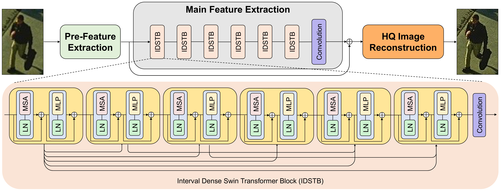
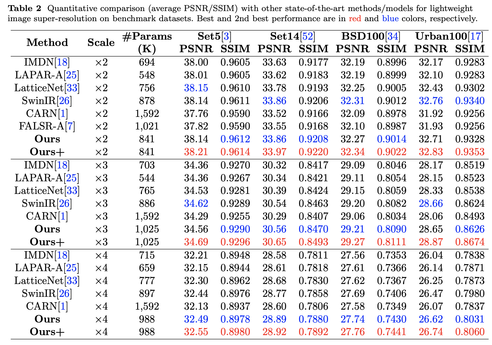
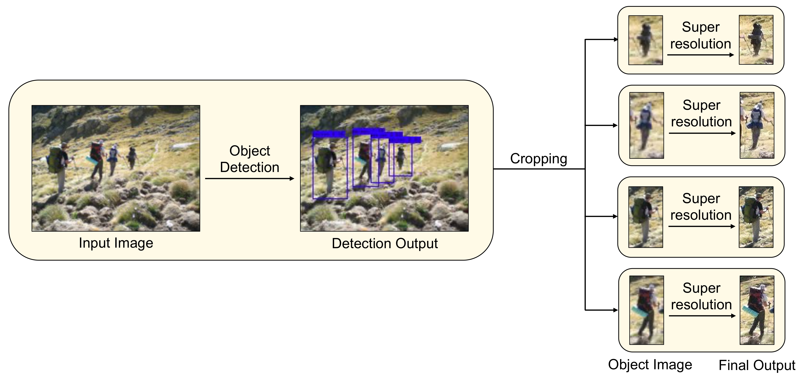
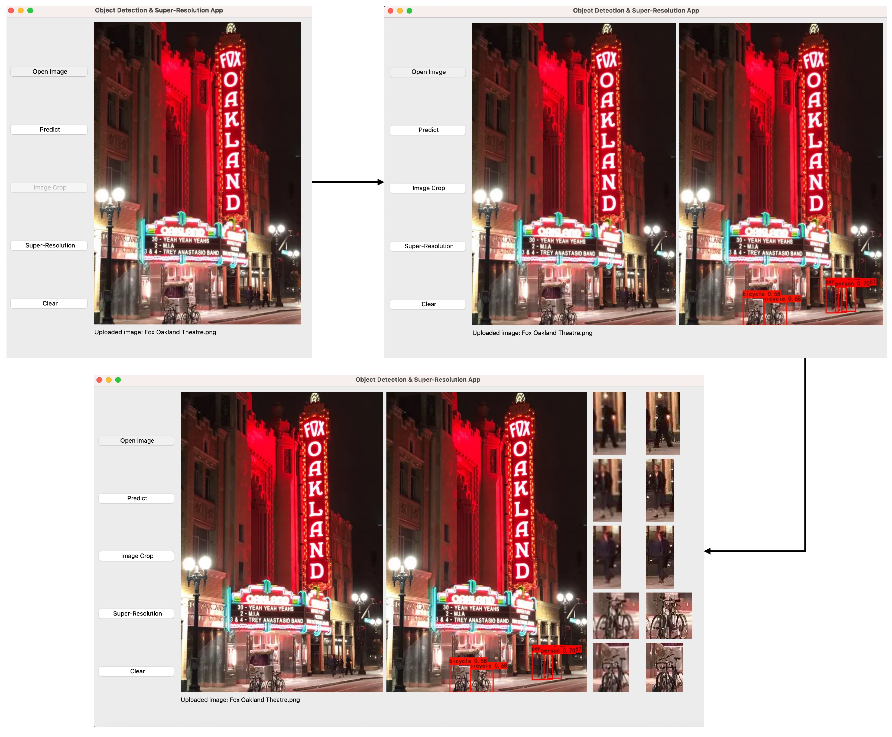

# Resolution Enhancement Processing on Low Quality Images Using Swin Transformer Based on Interval Dense Connection Strategy

> [Resolution Enhancement Processing on Low Quality Images Using Swin Transformer Based on Interval Dense Connection Strategy](https://arxiv.org/abs/2303.09190)

## Abstract
The Transformer-based method has demonstrated remarkable performance for image super-resolution in comparison to the method based on the convolutional neural networks (CNNs). However, using the self-attention mechanism like SwinIR (Image Restoration Using Swin Transformer) to extract feature information from images needs a significant amount of computational resources, which limits its application on low computing power platforms. To improve the model feature reuse, this research work proposes the Interval Dense Connection Strategy, which connects different blocks according to the newly designed algorithm. We apply this strategy to SwinIR and present a new model, which named SwinOIR (Object Image Restoration Using Swin Transformer). For image super-resolution, an ablation study is conducted to demonstrate the positive effect of the Interval Dense Connection Strategy on the model performance. Furthermore, we evaluate our model on various popular benchmark datasets, and compare it with other state-of-the-art (SOTA) lightweight models. For example, SwinOIR obtains a PSNR of 26.62 dB for ×4 upscaling image super-resolution on Urban100 dataset, which is 0.15 dB higher than the SOTA model SwinIR. For real-life application, this work applies the lastest version of You Only Look Once (YOLOv8) model and the proposed model to perform object detection and real-life image super-resolution on low-quality images.

### SwinOIR Network Architecture

  

## Open-Source
For research project agreement, we don't release training code, please refer to [EDSR framework](https://github.com/sanghyun-son/EDSR-PyTorch) and our paper for details.
- [x] Paper of our method [[arXiv]](https://arxiv.org/abs/2303.09190)
- [x] The pretrained model and test code.

## Citation
If you find our paper useful in your research, please consider citing:

    @article{ju2023resolution,
      title={Resolution enhancement processing on low quality images using swin transformer based on interval dense connection strategy},
      author={Ju, Rui-Yang and Chen, Chih-Chia and Chiang, Jen-Shiun and Lin, Yu-Shian and Chen, Wei-Han},
      journal={Multimedia Tools and Applications},
      pages={1--17},
      year={2023},
      publisher={Springer}
    }
  
## Requirements
* Linux (Ubuntu)
* Python >= 3.6
* Pytorch >= 1.5.0
* NVIDIA GPU + CUDA CuDNN

## Dataset
* DIV2K Dataset [(Download Link)](https://data.vision.ee.ethz.ch/cvl/DIV2K/)
* Set5 Dataset [(Download Link)](http://people.rennes.inria.fr/Aline.Roumy/results/SR_BMVC12.html)
* Set14 Dataset [(Download Link)](https://sites.google.com/site/romanzeyde/research-interests)
* B100 Dataset [(Download Link)](https://www2.eecs.berkeley.edu/Research/Projects/CS/vision/bsds/)
* Urban100 Dataset [(Download Link)](https://www.kaggle.com/datasets/harshraone/urban100)

## Experimental Results

  

## Application
### Overall two-stage framework

  

### Graphical User Interface 

  

## References
* [RLFN](https://github.com/bytedance/RLFN)
* [EDSR](https://github.com/sanghyun-son/EDSR-PyTorch)
* [Swin-Transformer](https://github.com/microsoft/Swin-Transformer)
* [SwinIR](https://github.com/JingyunLiang/SwinIR)
